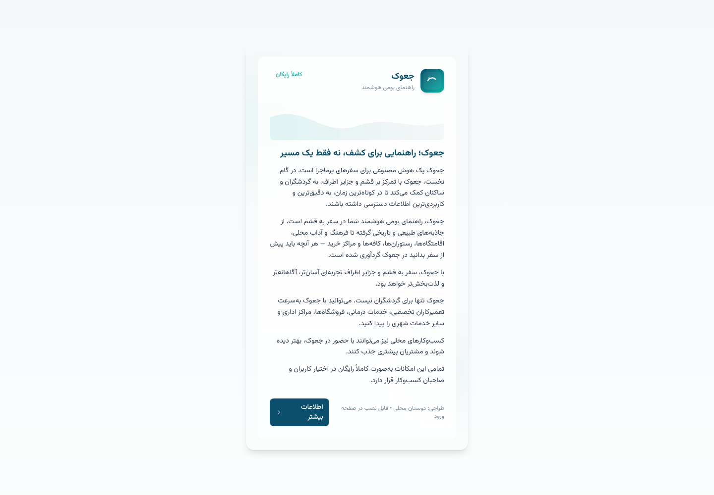
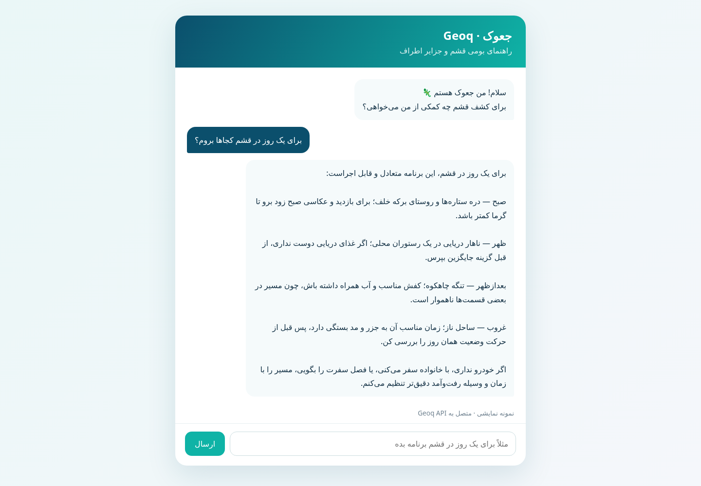

# Geoq showcase

This page demonstrates the public API and the product behavior contributors are helping improve.

## Health and model discovery

```bash
curl http://localhost:8001/health
```

Typical response before AI credentials are configured:

```json
{
  "status": "degraded",
  "model": "geoq-0",
  "orchestration": "LangGraph",
  "ai_resources": "not_ready"
}
```

This is intentional: contributors can verify that the API shell is alive without downloading model weights or connecting to Gemini.

## Non-streaming conversation

```bash
curl http://localhost:8001/v1/chat/completions \
  -H 'Content-Type: application/json' \
  -d '{
    "model": "geoq-0",
    "stream": false,
    "session_id": "demo-visitor",
    "messages": [
      {"role": "user", "content": "برای یک روز در قشم برنامه سفر بده"}
    ]
  }'
```

The response follows the familiar OpenAI-compatible shape:

```json
{
  "id": "chatcmpl-...",
  "object": "chat.completion",
  "created": 1760000000,
  "model": "Geoq",
  "choices": [
    {
      "index": 0,
      "message": {"role": "assistant", "content": "...پاسخ فارسی جعوک..."},
      "finish_reason": "stop"
    }
  ]
}
```

## Streaming

Set `"stream": true` to receive Server-Sent Events. Each event contains a small content delta, and the stream ends with `data: [DONE]`.

## Product behavior examples

| User need | Geoq behavior | Where to improve it |
| --- | --- | --- |
| «رستوران خوب معرفی کن» | Ask about cuisine, budget, and location | Clarification prompt and local data |
| «بهترین مسیر امروز چیست؟» | Use fresh lookup when current conditions matter | Search integration and safety copy |
| «دره ستاره‌ها کجاست؟» | Prefer local retrieval and Persian context | `data/knowledge/qa_qeshm.json` |
| «من غذای دریایی دوست دارم» then «کجا بروم؟» | Use conversation memory to personalize | Memory and fact extraction |

## What a detailed answer looks like

For a question such as «برای یک روز در قشم برنامه سفر بده», Geoq is intended to return an actionable plan rather than a generic list:

1. **Morning:** start with a nearby natural attraction such as the Stars Valley area and consider heat and travel time.
2. **Lunch:** suggest a local food direction while asking about dietary preferences and budget.
3. **Afternoon:** include practical preparation for places such as Chahkooh Canyon—water, shoes, and route conditions.
4. **Sunset:** suggest a tide-dependent location such as Naz Island and remind the visitor to check that day’s tide and access conditions.
5. **Follow-up:** ask whether the visitor has a car, how many people are traveling, and which season they are visiting in order to refine the route.

The exact recommendation should come from current local data and the connected lookup path. This example describes the intended answer quality and safety behavior; it is not a guarantee that every place is open or accessible.

## Visual showcase



Open [`t.html`](../t.html) locally in a browser to see the RTL Persian introduction card for جعوک. It is standalone and can be embedded into a future web client.

The reference chat client is built from [`examples/chat.html`](../examples/chat.html):



## Reference browser example

Start the API, then serve the repository root:

```bash
python -m api
python -m http.server 8080
```

Open [`examples/chat.html`](../examples/chat.html) at `http://localhost:8080/examples/chat.html`. This lightweight reference page sends real non-streaming requests to `http://localhost:8001/v1/chat/completions` and displays the Persian response. The production-oriented frontend is the customized Open WebUI branch; see [OPEN-WEBUI.md](OPEN-WEBUI.md). The browser API requires `CORS_ORIGINS=http://localhost:8080` in `.env`.
